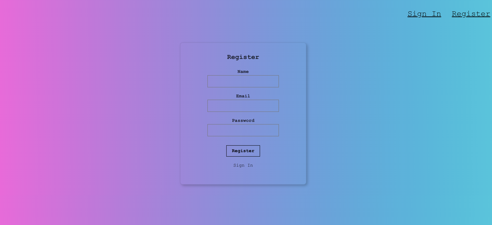

# SmartBrain

This is a face recognition React application that uses the 
Clarifai API (via machine learning face recognition), linked to a server and uses the postgreSQL Database to host users


| Home Page | Register Page |
| ------------- | ------------- |
| <p align="center"></p> | <p align="center"></p>  |

<h2>Getting Started</h2>

Clone the repository
   ```sh
   git clone https://github.com/LiorAtiya/SmartBrain.git
   ```
Install NPM packages (main folder, Back-end folder, Front-end folder
   ```sh
   npm install
   ```
   
Use docker or download local PostgreSQL and create database 'smartbrain'
   ```sh
   CREATE DATABASE smartbrain;
   ```
Inside the smartbrain database create 2 tables
   ```sh
   CREATE TABLE users (
        id serial PRIMARY KEY,
        name VARCHAR(100),
        email text UNIQUE NOT NULL,
        entries BIGINT DEFAULT 0,
        joined TIMESTAMP NOT NULL
    );

   CREATE TABLE login (
        id serial PRIMARY KEY,
        hash VARCHAR(100) NOT NULL,
        email text UNIQUE NOT NULL
    );
   ```
   
Go to the server file in the backend folder and change
   ```sh
    //Connect to postgreSQL
    const db = knex({
      client: 'pg',
      connection: {
        host: 'localhost',
        user: 'YOUR_USER',
        password: 'YOUR_PASSWORD',
        database: 'smartbrain',
      }
    })
   ```


Run the project - Frontend & Backend folders
   ```sh
   npm run start
   ```
   

<h2>Usage</h2>

1. Signin

    - Enter email and password to login or click on the register buttons to register and create an account.

2. Home
    - Enter the URL in the input box and press the Detect Button
    - The image will display below the bar along with the bounding box detecting the face, if any.
    - Based on the number of users and the times you have detected faces, the app will give you a ranking of where you stand on the leaderboard.
3. Register
    - Fill the form and it will take you to the login page to signin.
    
    
<h2>Technologies</h2>

<span>
  


  

  
 
  
  
  
  


