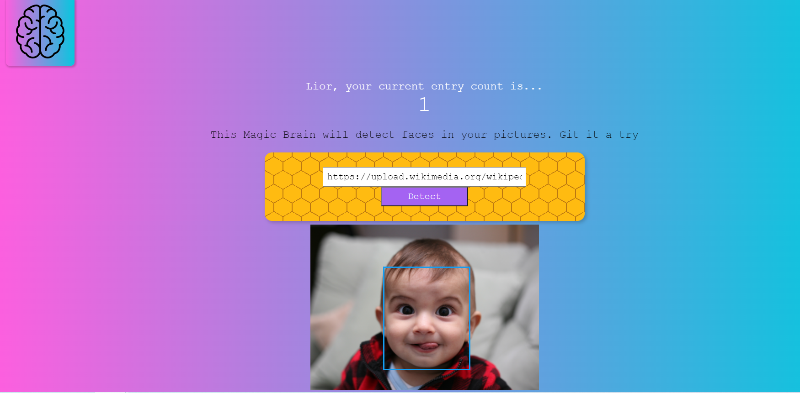

# SmartBrain - Final project for ZTM course: The Complete Web Developer

This is a face recognition React application that uses the 
Clarifai API (via machine learning face recognition), linked to a server and uses the postgreSQL Database to host users

## Usage

Link: https://smart-brain-lior.herokuapp.com/

1. Signin/Login

    - Enter email and password to login or click on the register buttons to register and create an account.

2. Home
    - Enter the URL in the input box and press the Detect Button
    - The image will display below the bar along with the bounding box detecting the face, if any.
    - Based on the number of users and the times you have detected faces, the app will give you a ranking of where you stand on the leaderboard.
3. Register
    - Fill the form and it will take you to the login page to signin.
